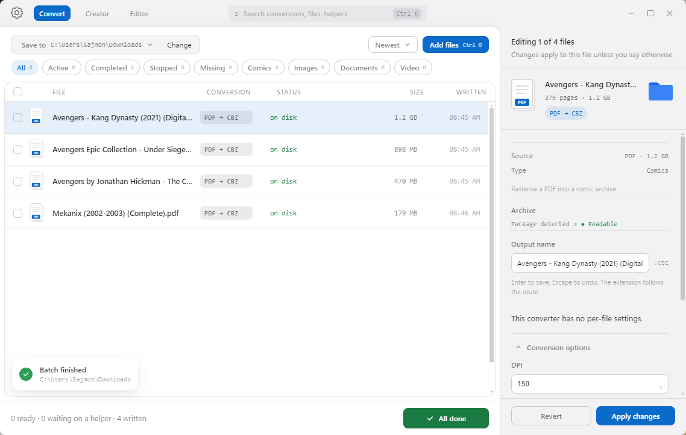

<div align="center">


# One Tool

**Local-first file conversion for comics, images, documents, ebooks, archives and video.**

Files in. The format you actually wanted out. Nothing leaves your machine.

[](https://github.com/Brightwav3/One-tool-to-rule-them-all/releases)
[](#install)
[](app/package.json)
[](#requirements)
[](converter)
[](LICENSE)
[](https://github.com/Brightwav3/One-tool-to-rule-them-all/stargazers)

[Features](#features) · [Conversions](#supported-conversions) · [Install](#install) · [API & CLI](#api-and-command-line) · [Architecture](#architecture) · [Privacy](#privacy)

</div>

<p align="center">
  
</p>

---

## Why

Every file conversion sends you somewhere different: an upload site for HEIC photos, a 200 MB Java app
for comics, a command-line incantation for PDFs you look up every time. Most of them want your files on
their server.

One Tool is a single window that handles all of it locally, and tells you exactly what it can and
cannot do on your machine right now.

## Features

- 🗂️ **Mixed queue.** Drop a CBZ, three HEICs and a PDF at once. Each file is routed by extension and labelled with its conversion.
- ✅ **Honest readiness.** Every route's state is computed from what's installed: **Ready**, **Needs a helper** (with the exact install command for your platform), or **Soon**. Nothing is offered that can't run.
- 📈 **Live progress.** Page-by-page where the format allows it, not a spinner.
- 🎛️ **Per-file options.** Title and creator for comics, quality and max edge for photos, DPI for PDFs — whatever each converter declares.
- ✏️ **Rename before converting.** From the inspector, the context menu, or by double-clicking a row. The extension follows the route; your source file is never touched.
- 🧯 **Isolated errors.** A bad file gets its own message on its own card. The queue keeps going.
- 🌊 **Streaming.** A 400 MB archive never sits in RAM; pages are copied one at a time.
- 🕘 **Session history.** Every run is recorded, with an operation to put its files back in the queue.
- 🤖 **Agent-ready.** A JSON CLI and local HTTP API expose the same queue to scripts and AI agents.

## Supported conversions

**65 routes are declared; 63 are implemented.** The remaining two are clearly marked as coming soon.

| Category | Conversion | Needs |
| --- | --- | --- |
| **Comics** | CBZ → EPUB | *nothing* |
| | CBR → EPUB | 7-Zip |
| | CBZ → PDF | Python stdlib; ImageMagick fallback |
| | CBR → PDF | 7-Zip + Python stdlib; ImageMagick fallback |
| | CBR → CBZ | 7-Zip |
| | PDF → CBZ | Python stdlib for safe JPEG extraction; Poppler fallback |
| | RAR / 7z → CBZ | 7-Zip |
| **Images** | HEIC → JPG / PNG / WebP / PDF | ffmpeg or ImageMagick |
| | PNG → WebP / JPG / PDF | ffmpeg or ImageMagick; direct PDF writer where possible |
| | JPG → PNG / WebP / PDF | ffmpeg or ImageMagick; direct PDF writer where possible |
| | WebP → JPG / PNG / PDF | ffmpeg or ImageMagick; direct PDF writer where possible |
| | PDF → JPG / PNG | Poppler — one chosen page (whole documents go to CBZ) |
| | GIF → JPG / PNG / PDF | ImageMagick or ffmpeg — first frame |
| | AVIF → JPG / PNG / PDF | ImageMagick or ffmpeg |
| | BMP → JPG / PNG / PDF | ImageMagick or ffmpeg |
| | TIFF → JPG / PNG / PDF | ImageMagick or ffmpeg — first page |
| | SVG → PNG / JPG / PDF | ImageMagick |
| | RAW → DNG | *coming soon* |
| **Documents** | DOC / DOCX / ODT → PDF / EPUB / TXT | LibreOffice |
| | PDF → TXT | Poppler |
| | PDF → Markdown | Node.js + Firecrawl pdf-inspector |
| | MD → PDF | *coming soon* |
| **Ebooks** | EPUB → CBZ | *nothing* |
| | EPUB → MOBI | Calibre |
| | EPUB → TXT | Python stdlib |
| | EPUB → PDF | Python stdlib for image-only EPUBs; Calibre fallback |
| | MOBI / AZW3 → EPUB / PDF | Calibre |
| **Archives** | RAR / 7z → ZIP | 7-Zip |
| | Creator items → ZIP / TGZ / 7z | Python stdlib; 7-Zip for 7z |
| **Creator** | Items → CBZ / CB7 / EPUB / PDF / TIFF | Python stdlib; 7-Zip or ImageMagick where needed |
| **Video** | MOV → MP4 | ffmpeg |

The live registry is the source of truth for each route's current helper requirements.

> [!NOTE]
> PDF → Markdown uses Firecrawl's [pdf-inspector](https://github.com/firecrawl/pdf-inspector#benchmark),
> chosen from its published 200-PDF benchmark (0.875 overall quality, 0.915 reading order, 0.814 tables,
> 0.47 s/document with OCR disabled). Scanned PDFs still need OCR. It runs natively on Apple Silicon and
> via WebAssembly on Intel.

> [!NOTE]
> The PDF Editor is temporarily hidden from the main navigation while conversion work continues. Its code
> remains in the repository.

## Install

### Windows

Download the [Windows installer](https://github.com/Brightwav3/One-tool-to-rule-them-all/releases/download/v2.2.1/OneTool-Web-Setup-2.2.1.exe)
from [Releases](https://github.com/Brightwav3/One-tool-to-rule-them-all/releases) and run it.

### macOS

Build a universal DMG and ZIP (Intel + Apple Silicon):

```bash
brew install node
npm --prefix app install
npm --prefix converter install
npm --prefix app run dist:mac
```

The build lands in `dist/`. On first launch the app looks for Python 3.10+ in Homebrew, python.org,
common version managers and `PATH`; if none is found, it downloads the official macOS installer and
guides you through it. Missing optional helpers can be installed individually with Homebrew from
**Settings → Helpers** (the app links to Homebrew's setup page but never installs Homebrew itself).

> [!IMPORTANT]
> Builds without a Developer ID certificate are unsigned. Public distribution requires Developer ID
> signing and notarization, and in-app updates require a signed app. See
> [Electron's macOS signing guide](https://www.electron.build/mac/).

### Requirements

- **Python 3.10+** — the backend uses the standard library only, no third-party packages
- **Node 18+** — the Electron shell and the optional PDF → Markdown worker
- **Optional helpers**, only for the conversions that name them: 7-Zip, Poppler, ffmpeg, ImageMagick, LibreOffice, Calibre

<details>
<summary><b>Helper detection and overrides</b></summary>

<br>

The conversion backend never downloads or executes helper installers. On macOS, the desktop shell can
run the fixed Homebrew commands listed for each helper from **Settings → Helpers**. Otherwise, install
helpers yourself and call the `recheck` API or agent command.

On Windows, every helper is resolved from `PATH`, standard `Program Files` and per-user folders,
WinGet/Scoop/Chocolatey locations, and an explicit `ONETOOL_<HELPER>` override. If an installer changed
`PATH`, restart the backend before re-checking.

Available overrides: `ONETOOL_7Z`, `ONETOOL_POPPLER`, `ONETOOL_FFMPEG`, `ONETOOL_IMAGEMAGICK`,
`ONETOOL_LIBREOFFICE`, `ONETOOL_CALIBRE`, `ONETOOL_RAW_TOOL`, `ONETOOL_PANDOC`, `ONETOOL_PDF_RENDERER`.
An override may point to the executable or its folder. A downloaded installer does not count until it
has been installed or extracted.

</details>

## Development

```bash
git clone https://github.com/Brightwav3/One-tool-to-rule-them-all.git
cd One-tool-to-rule-them-all
npm --prefix app install
npm --prefix converter install   # optional: PDF → Markdown worker
npm --prefix app start
```

The Electron shell starts the local backend automatically. History and settings are stored locally.

## API and command line

### HTTP API

```bash
python converter/server.py
```

Listens on `http://127.0.0.1:8756` and exposes JSON endpoints only. Clients pass local paths through
`/api/add-path` or stream bytes through `/api/upload`; no graphical picker is required.

### Standalone comics converter

`cbz_to_epub.py` has no dependencies at all and exits `0` on success, `1` on failure:

```bash
python converter/cbz_to_epub.py "My Comic v01.cbz" out.epub --title "My Comic, Vol. 1" --creator "A. N. Author"
```

### Agent tools

`converter/agent_tools.py` drives the same local queue and prints one JSON document per command.
`--start` spins up a private localhost backend for that command and shuts it down afterward.

```bash
# Converter capabilities and readiness
python converter/agent_tools.py --start tools

# Convert and wait for results
python converter/agent_tools.py --start convert input.pdf --converter pdf-md --output-dir out

# Pass converter-declared options
python converter/agent_tools.py --start convert comic.cbz --converter cbz-epub \
  --option title="My Comic" --option creator="A. N. Author"

# Reuse a running backend (or set ONETOOL_URL)
python converter/agent_tools.py --url http://127.0.0.1:8756 status
```

Operations: `tools`, `status`, `convert`, `wait`, `recheck`, `specs`. `specs` prints JSON tool
definitions for agent runtimes. Converter IDs and option keys come from the live registry.

## Architecture

```
converter/
├── registry.py             # converter model — state is computed, never asserted
├── formats_registry.py     # route declarations and shared registry
├── formats_common.py       # shared helpers, image/archive primitives
├── formats_archives.py     # archive repacking
├── formats_comics.py       # CBZ/CBR/PDF comic routes
├── formats_creator.py      # multi-file container writers
├── formats_documents.py    # document and ebook conversions
├── formats_images.py       # raster, vector and RAW image conversions
├── formats_pdf_convert.py  # PDF to other formats
├── formats_pdf_extract.py  # PDF text and Markdown extraction
├── formats_pdf_writer.py   # direct PDF output
├── formats.py              # compatibility facade for older imports
├── cbz_to_epub.py          # standalone stdlib comics converter
├── server.py               # local JSON HTTP API and job queue
├── agent_tools.py          # JSON command-line tools for agents
└── pdf_to_md.cjs           # optional Node worker for PDF → Markdown
app/
├── main.js                 # Electron main process and window shell
├── preload.js              # restricted renderer bridge
└── package.json            # Electron and packaging config
```

**Adding a conversion** means implementing it in the matching `formats_*.py` module and declaring its
route in `formats_registry.py`. The registry, queue, API and agent tools all consume the same model,
and every backend layer works without a UI. See [docs/architecture.md](docs/architecture.md) for more.

<details>
<summary><b>Under the hood</b></summary>

<br>

- **Conversions stream.** Pages are copied archive-to-archive a megabyte at a time with a
  `progress(done, total)` callback, so memory stays flat regardless of file size.
- **Comic PDFs have a fast path.** JPEG pages are embedded without decoding or recompression.
  Compatible non-interlaced PNGs use FlateDecode with alpha masks where needed. WebP, GIF, AVIF and
  incompatible PNGs fall back to ImageMagick one page at a time.
- **Scan PDFs extract safely.** Classic-xref PDFs with one validated DCTDecode JPEG per image-only page
  are copied straight into a CBZ in page-tree order. Anything malformed or mixed falls back to bounded
  Poppler rasterization.
- **PDF → Markdown uses one persistent worker.** Batches reuse a serialized Node process; a crashed
  worker is restarted once, and each output is committed atomically.
- **Natural sorting and safe paths.** `page2.jpg` comes before `page10.jpg`, and unsafe archive paths
  are rejected outright.

</details>

## Roadmap

- [x] Converter registry — formats declare themselves, the API follows
- [x] Mixed queues with automatic routing
- [x] Helper detection with per-platform install instructions
- [ ] RAW → DNG
- [ ] MD → PDF

## Privacy

One Tool has no analytics or telemetry. The backend binds to `127.0.0.1`, files are never uploaded,
and helpers are only launched locally for the conversion that needs them.

## License

[MIT](LICENSE) © 2026 Brightwav3
