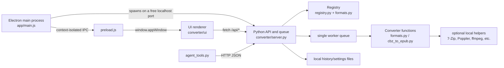
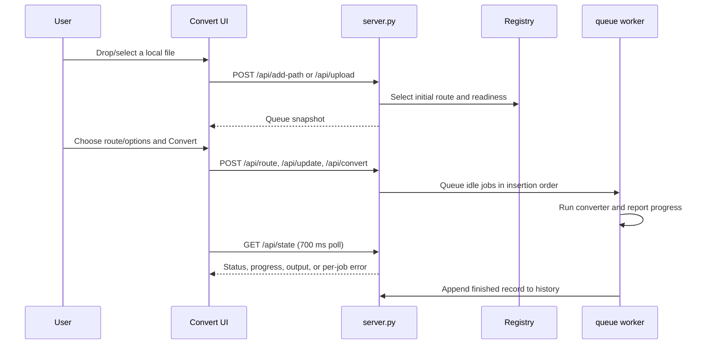

# One Tool to Rule Them All — architecture map

This is a local-first file converter. The Electron desktop application, its
Python HTTP backend, the conversion queue, history, and the agent CLI all run
on the user's machine. The backend listens only on `127.0.0.1`; input files
are not uploaded to a service.

## Start here

| If you want to… | Start with | Then follow |
| --- | --- | --- |
| Run the desktop app | `app/main.js` | Electron starts `converter/server.py`, then loads the UI from the local API server. |
| Add or change a conversion | `converter/formats.py` | The `CONVERTERS` list feeds the registry, UI capabilities, HTTP API, and agent CLI. |
| Change converter readiness or helper discovery | `converter/registry.py` | `Helper`, `Converter`, and `Registry` compute `ready`, `helper`, and `soon` states. |
| Change queue behaviour or the HTTP API | `converter/server.py` | `Converter` owns jobs and the single worker; `Handler` maps `/api/*` routes. |
| Change the conversion screen | `converter/ui/workspaces/convert/` | Rendering is in `convert-view.js`; queue-specific state/selectors are nearby. |
| Change Creator or Editor | `converter/ui/workspaces/creator/` or `converter/ui/workspaces/editor/` | Their state and view code are intentionally grouped by workspace. |
| Change desktop-only behaviour | `app/preload.js` and `app/main.js` | Add a restricted preload bridge before adding an IPC handler. |
| Verify a backend change | `tests/` | Python `unittest` cases cover registry, API, queue, creator, and conversion hardening. |

## Repository layout

```text
.
├── app/                         Electron desktop shell and packaging setup
│   ├── main.js                  Main process: backend lifecycle, window, IPC, updates
│   ├── preload.js               Narrow, context-isolated renderer bridge (`window.appWindow`)
│   ├── pdf_to_md.cjs            Packaged launcher for the PDF-to-Markdown worker
│   └── package.json             Electron scripts, builder configuration, release target
├── converter/                   Local Python conversion backend
│   ├── server.py                Queue, persistence stores, local JSON API, static UI serving
│   ├── registry.py              Converter data model and external-helper discovery
│   ├── formats.py               Converter declarations and conversion implementations
│   ├── cbz_to_epub.py           Standalone stdlib CBZ-to-EPUB converter and CLI
│   ├── agent_tools.py           Machine-readable command-line client for the local API
│   ├── pdf_to_md.cjs            Persistent Node/pdf-inspector worker protocol
│   ├── package.json             Optional Node dependency for PDF-to-Markdown
│   └── ui/                      Browser renderer served by `server.py`
├── tests/                       Python unit/integration tests and UI verification harnesses
│   └── ui/                      Browser smoke/trace scripts and recorded baselines
├── docs/                        UI decomposition notes, progress log, and visual baselines
├── README.md                    User-facing installation, capabilities, and operational guide
├── WORKPLAN.md                  Design/implementation plan for Creator and Editor
└── LICENSE                      MIT license
```

## Runtime architecture



There are two supported ways into the application:

1. `npm start` in `app/` starts Electron. `app/main.js` reserves a free
   localhost port, spawns `converter/server.py`, waits for it, and points the
   `BrowserWindow` at that backend.
2. `python converter/server.py` starts the backend directly. A browser client
   can use the UI and an automation client can use `agent_tools.py` against the
   same JSON API.

The desktop shell injects per-user history and the packaged PDF worker paths
through environment variables. In development, the backend runs from the
neighbouring `converter/` directory; in a packaged build it runs from bundled
Electron resources.

## Backend: source of truth

### `converter/registry.py`

The registry is the capability model. It defines:

- `Option`: a publicly editable converter option such as title, quality, or DPI.
- `Helper`: a locally installed dependency with executable lookup rules,
  environment-variable overrides, and platform installation information.
- `Converter`: one input/output route, including accepted extensions, required
  helper, options, probe function, conversion function, and whether it builds
  from multiple sources.
- `Registry`: route selection and serialisation of all capabilities for clients.

Helpers are resolved from explicit `ONETOOL_*` overrides, `PATH`, and common
platform installation paths. The visible state is derived at runtime:

- `ready`: an implementation and any required helper are available.
- `helper`: the route is implemented but its required helper is missing.
- `soon`: the route is declared but has no implementation yet.

Do not hard-code availability in the UI or the API. Add the helper requirement
and implementation to the registry data, then let every caller consume the
computed state.

### `converter/formats.py`

This is the main conversion catalogue and implementation module. It contains
the `CONVERTERS` list, then creates the shared `REGISTRY` from it. Most work on
a file type belongs here:

- archive/comic routes and safe archive handling;
- direct PDF paths for compatible JPEG/PNG data and bounded fallbacks;
- PDF page rendering, image/document/ebook conversion helpers;
- creator/container writers for ZIP, TGZ, 7Z, EPUB, PDF, TIFF, and comics;
- the persistent PDF-to-Markdown Node worker wrapper;
- atomic-output and partial-output cleanup utilities.

Each converter function receives a source, output path, option dictionary, and
progress callback. A converter must report progress through that callback and
must not update UI state directly.

### `converter/cbz_to_epub.py`

This is the dependency-free, importable CBZ-to-EPUB implementation. It safely
lists archive images, sorts pages naturally, writes a valid EPUB atomically,
and provides a direct command-line interface. `formats.py` uses it for the
registered CBZ route rather than duplicating its archive logic.

### `converter/server.py`

`server.py` combines the local service boundary and queue orchestration.

| Area | Responsibility |
| --- | --- |
| `HistoryStore` | Persists and manages completed conversion records. |
| `SettingsStore` | Persists the selected and recent output folders. |
| `Job` | Holds one queued conversion's source(s), output, options, progress, and error state. |
| `Converter` | Owns ordered jobs and a single background worker; converts one job at a time. |
| `Handler` | Serves `converter/ui/` and implements the localhost JSON API. |

The queue accepts both one source (ordinary conversion) and many sources
(Creator containers). Job mutations are rejected while a job is queued or
running. The worker catches failure per job, records a useful error, and
continues with the next queued job so one bad input does not stop a batch.

Important API groups are:

| Group | Routes |
| --- | --- |
| Read state | `GET /api/tools`, `/api/state`, `/api/history` |
| Add input | `POST /api/upload`, `/api/add-path`, `/api/probe` |
| Queue editing | `/api/route`, `/api/rename`, `/api/update`, `/api/remove`, `/api/remove-many`, `/api/clear` |
| Execution | `/api/convert`, `/api/recheck` |
| Output folders and files | `/api/pick-files`, `/api/pick-folder`, `/api/set-folder`, `/api/forget-folder`, `/api/reveal` |
| History | `/api/history/delete`, `/api/history/requeue`, `/api/history/rename`, `/api/history/reveal` |
| Creator | `/api/recipes`, `/api/create` |

The API returns snapshots with `files`, tool readiness, output folders, and
counts. This lets the UI be a client of backend state rather than a second
queue implementation.

### `converter/agent_tools.py`

This is a JSON-in/JSON-out automation client, not another converter engine. It
calls the same local API used by the renderer. Commands include `tools`,
`status`, `convert`, `wait`, `recheck`, and `specs`. With `--start`, it starts
a private server if one is not already supplied; otherwise it targets the URL
from `--url` or `ONETOOL_URL`.

### `converter/pdf_to_md.cjs`

This is the Node-side worker for PDF-to-Markdown, backed by
`@firecrawl/pdf-inspector`. `formats.py` keeps one persistent worker process
for batch work, serialises calls to it, restarts it once after a crash, and
atomically commits the resulting Markdown output.

## Desktop shell

### `app/main.js`

The Electron main process is responsible for desktop integration only:

- locating development versus packaged converter resources;
- selecting a free `127.0.0.1` port and starting the Python backend;
- creating the frameless, context-isolated `BrowserWindow`;
- forwarding window state and persisting theme preference;
- packaging/downloading approved helper installers;
- configuring packaged-only auto-update state; and
- stopping the backend when Electron exits.

Do not put renderer code or conversion rules here. If the renderer needs a
desktop capability, expose the minimal operation through the preload layer.

### `app/preload.js`

The renderer does not have Node integration. `preload.js` publishes the small
`window.appWindow` API for title-bar controls, theme state, update state, file
paths from dropped Electron files, and helper-download progress. It is the
security boundary between browser code and Electron IPC.

### `app/package.json`

Defines `npm start`, Windows packaging/release commands, and `electron-builder`
configuration. The builder packages `main.js`, `preload.js`, and the PDF worker,
then copies `converter/` as an unpacked extra resource.

## Renderer layout: `converter/ui/`

`index.html` is the shell, stylesheet list, and ordered list of classic scripts.
These are deliberately not ES modules: shared globals and load order are part
of the current architecture. When adding a script, put it after the globals it
reads and before code that calls it.

```text
converter/ui/
├── index.html                   App shell and CSS/script load order
├── app/
│   ├── bootstrap.js             Wires startup, fetches initial state, begins polling
│   ├── app-context.js           DOM references, theme hydration, shell context
│   ├── app-state.js             Shared renderer state and selection helpers
│   └── render.js                Central render gate and page composition
├── core/
│   ├── api-client.js            POST helper, backend snapshot absorption, history refresh
│   ├── actions.js               Backend-facing UI actions and navigation
│   ├── capabilities.js          Tool/capability helpers
│   ├── formatters.js            Shared presentation formatting
│   └── ids.js                   Stable client-side ID generation
├── workspaces/
│   ├── convert/                 Convert queue state, selectors, and view
│   ├── creator/                 Multi-file creation state, bridge, actions, and view
│   └── editor/                  Editor state and view
├── features/
│   ├── command-palette/         Palette UI
│   ├── inspector/               Side-panel view and controller
│   ├── notifications/           Toasts
│   └── settings/                Settings UI and actions
├── components/                  Reusable DOM fragments: rows, menus, modal, icon, dropdown
├── interaction/                 Event routing, keyboard, drag/drop, selection, resizing
└── styles/                      Tokens, shell, workspace, component, overlay, and motion CSS
```

The renderer keeps a single shared state model in `app/app-state.js`. API
responses pass through `core/api-client.js`'s `absorb()` function, which updates
that model and calls `render()`. `app/render.js` computes a signature to avoid
unnecessary full renders, preserves active text input while typing, and invokes
the individual workspace/feature renderers.

### Main UI flows

#### Convert a file



#### Create an archive/container

Creator is a separate workspace because it builds a new file from multiple
items rather than converting one input. The UI probes selected items through
`/api/probe`, chooses a `multi` converter, and submits `/api/create`. The
server creates one multi-source `Job`; the normal queue then runs its converter
from `formats.py` and records the outcome in the same history store.

#### Desktop-only action

For title-bar controls, theme persistence, updater state, dropped-file path
lookup, and helper downloads, the call path is:

`renderer → window.appWindow (preload) → ipcMain handler (main.js) → Electron/OS`

For ordinary conversion actions, use HTTP instead. Do not add Electron IPC for
operations that must also work in a browser or through `agent_tools.py`.

## Data and persistence

- The in-memory queue is owned by `Converter` in `server.py` and is not a
  database. Restarting the backend clears active jobs.
- History and output-folder settings are JSON stores managed by `HistoryStore`
  and `SettingsStore`. Electron passes a user-data history path when it starts
  the backend.
- UI-only preferences such as theme, inspector width, and settings controls use
  renderer `localStorage`, except theme which is also persisted by Electron for
  early window hydration.
- Outputs are written to the chosen local output folder. Conversion writers use
  atomic/partial-output patterns where supported so incomplete work is not
  presented as a finished file.

## Tests and verification

```text
tests/
├── test_registry.py             Registry routes, helper/readiness behaviour
├── test_backend_api.py          Local HTTP API contract
├── test_server_ux.py            Queue, errors, history, and server UX cases
├── test_creator.py              Multi-item Creator inputs, options, recipes, routes
├── test_direct_pdf.py           Direct PDF writing/extraction paths
├── test_phase1_hardening.py     Safety and edge-case regressions
├── test_phase3.py               Conversion/backend regression coverage
├── test_phase4.py               Further phase regression coverage
├── test_ui_state.cjs            Isolated renderer state checks
└── ui/
    ├── smoke.js                 Browser smoke sweep
    ├── trace.js                 Behavioural trace recorder
    ├── trace-diff.cjs           Baseline/current trace comparison
    └── traces/                  Recorded baseline and head traces
```

The Python tests are standard-library `unittest` files and can be run with:

```bash
python -m unittest discover -s tests
```

The browser UI harness instructions live in `tests/ui/README.md`. It compares
observable requests, toasts, render passes, page state, DOM structure, and
computed style hashes against a recorded baseline. `docs/baseline/` provides
visual screenshots for checks that need the actual Electron window.

## Developer navigation patterns

### Add a new one-file conversion

1. Implement the converter/probe function in `converter/formats.py`.
2. Add a `Converter(...)` declaration to `CONVERTERS`, including source
   extensions, output extension, required helper, options, and conversion
   callback.
3. Add or reuse a `Helper` in `converter/registry.py` when an external tool is
   required.
4. Add focused tests under `tests/` for routing, readiness, and the conversion
   boundary.
5. The backend API, agent CLI, and UI route picker receive the new capability
   from the live registry; add UI code only if the format needs a new control.

### Add a new Creator output

1. Add the multi-source writer and options in `converter/formats.py`.
2. Declare the converter with `multi=True` so it is grouped into Creator
   capabilities rather than ordinary Convert routes.
3. Test `/api/probe` and `/api/create` behaviour in `tests/test_creator.py`.
4. Update Creator view code only for controls not already represented by the
   generic options model.

### Change a UI action safely

1. Find the `data-act` source in the relevant workspace/feature renderer.
2. Follow it through `interaction/action-router.js` to the action function.
3. Keep backend calls in `core/actions.js` or workspace-specific action files.
4. Keep shared backend state mutations flowing through `api-client.js` and
   `render()`.
5. Check `tests/ui/README.md` before refactoring load order, global bindings,
   or rendered structure.

## Supporting documentation

- `README.md` is the product and operations guide: supported conversions,
  dependencies, installation, API/CLI examples, and packaging expectations.
- `docs/architecture.md` documents the UI decomposition history and the
  constraints of the current classic-script architecture.
- `docs/progress.md` explains extraction/verification progress and remaining UI
  architectural work.
- `docs/ui-inventory.md` is the baseline inventory of UI actions, globals, and
  functions used by the decomposition effort.
- `WORKPLAN.md` records the design and implementation order for Creator and
  Editor work.
